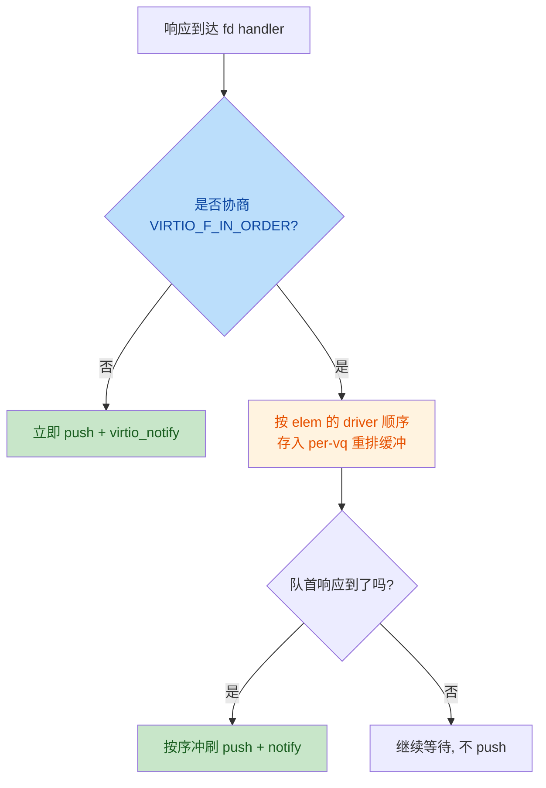
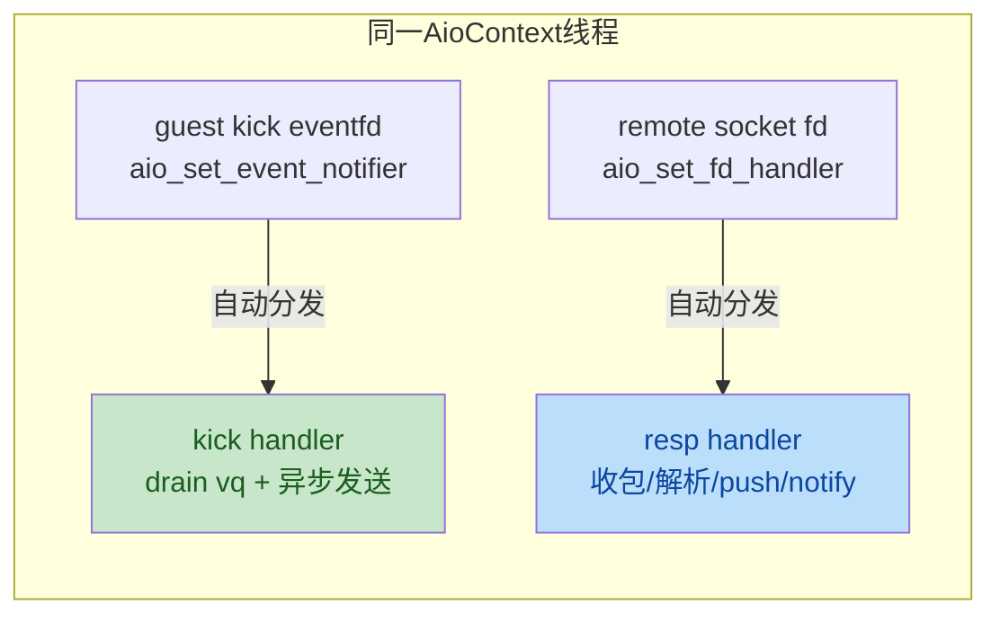
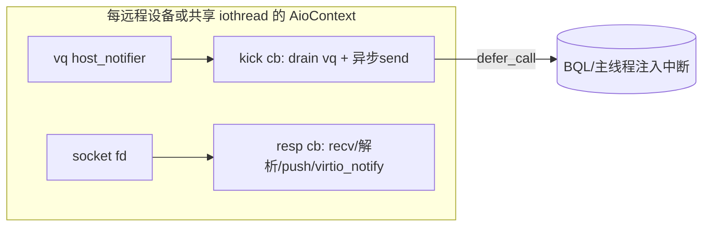

# Review virtio-remote Project

> **Workspace:** /home/waiai/svm

---

**User**

Use Skill: TRAE-code-review 现在有一个virtio-remote项目，代码文件在local_qemu/hw/virtio-remote目录下。主要思路是通过将virtio的driver写入ring的请求利用TCP转发给部署在另一台机器上的virtio device，实现guest跨物理机的资源使用。现有实现主要是对host_notifier的回调进行了重定向，当device被配置为remote的时候，就会将host_notifier的回调函数注册为remote的notify函数。driver端每次notify都转发elem，并等待device的回复。审阅该项目，找到可能存在的bug，并判断该项目当前是否支持所有virtio设备。

**Assistant**

我将对 `local_qemu/hw/virtio-remote` 项目进行全面代码审查。范围已明确（整个项目目录），现在开始收集上下文。

项目结构很小，只有 3 个文件。让我读取全部内容。

主文件有 1254+ 行，我继续读取剩余部分，并查找 `virtio-remote.h` 头文件及被修改的 QEMU 核心文件。

现在查看 QEMU 核心文件被修改的部分，以及 git 历史了解改动范围。

未提交的 diff 只有一行注释变更，其余 remote 支持已在提交中。让我读取 virtio.c 中与 remote 交互的关键区域。

现在查看 virtio-blk.c 和 virtio-crypto.c 中的 remote 相关修改。

---

**User**

继续

**Assistant**

Error: exceeded output window

---

**User**

继续

**User**

你只需要给我列出可能的bug就行。不需要给出修正方案。尽快给出。

**Assistant**

我先验证几个关键点：virtqueue_fill 是否执行 DMA unmap、以及设备模型如何使用 elem 的 sg。

让我再确认几个影响"设备支持范围"判断的关键点：stub 侧没有 guest 时 vring 为 NULL，设备模型的 `virtio_queue_set_notification` 等操作是否会崩溃；以及 ioeventfd/数据面路径。

上下文收集完毕。我已通读 virtio-remote.c、virtio-remote.h、virtio.c 的 remote 集成点、qdev-monitor/main.c/runstate.c 的启动路径。现在整理初步发现的问题，并派 2 个并行子代理做交叉验证。

我将开始独立验证这些疑似 bug。首先做快速记忆检查并同时读取核心文件。

我将作为代码审查验证员，逐条读取代码核实这些疑似 bug。首先并行读取核心文件。

已读取 virtio-remote.c 全文。现在并行读取 virtio.c 相关机制、记忆上下文。

已读取 virtio-remote.c 全文。现在并行读取 virtio.c 中相关改动区域，以及确认 virtqueue_pop/push 的锁行为。

现在读取 virtqueue_pop 实现及 remote_ctx 结构定义。

继续读取 virtio.c 中 virtqueue_pop、host notifier、start/stop ioeventfd 区域及 VirtQueue 结构定义。

继续读取 virtqueue_split_pop 开头、VirtQueue 结构定义，以及 virtio-bus 中 host_notifier 回调线程上下文。

最后确认 virtio.c 中 2660-2675 行 remote_ctx 释放的上下文，以及 host_notifier 的 ioeventfd 线程模型。

我已完整读取了 `/home/waiai/svm/local_qemu/hw/virtio-remote/virtio-remote.c`（全文1254行）和 `hw/virtio/virtio.c` 中所有相关改动（`virtqueue_push/fill/pop/flush/empty`、`virtio_device_start/stop_ioeventfd_impl`、host_notifier 注册、`VirtQueue` 结构体、`virtio_delete_queue` 等），逐条核对了行号与调用链。以下验证结果全面、完整，可以直接采信，无需再次搜索。

---

## 逐条验证结果

### 1. [多vq串行化/丢请求] — exists: true, severity: critical
- 确认行号：virtio-remote.c:488-489（`gsi_ctxes` 以 `DEVICE(vdev)->id` 为键，per-device 单例 CommCTX）；1082（`qatomic_cmpxchg(&comm_ctx->used, false, true)` 失败即 `return`，丢弃本次 kick）；1101（sender 只绑定触发 kick 的 `vq`）。
- reasoning：多个 vq 共用同一 CommCTX，第二个 vq 的 kick 在 `used==true` 时被静默丢弃，而 `remote_virtio_queue_host_notifier_read` 已 `event_notifier_test_and_clear`（1142行），且 `aio_poll_ready` 只在 notifier 再次可读时触发，被丢弃的 kick 无任何兜底重放机制 → 该 vq 的请求（如 virtio-net rx、virtio-scsi 各 vq）永久挂起。路由线程只从触发 kick 的那个 vq pop，其它 vq 的 elem 永远不会被发送到远程。多队列设备功能层面直接失效。

### 2. [ring溢出] — exists: true, severity: critical
- 确认行号：virtio-remote.c:59（`RING_SIZE = IO_URING_DEPTH * 4 = 128`）；990-991（`sem3` 限流整段被注释，且 CommCTX 结构体 174-184 行已无 `sem3` 字段）；995-998（`ring[tmp_sent % RING_SIZE]` 写入后 `sent` 递增）。
- reasoning：`sent` 只增不减、无在途上限。当远程响应慢导致 `sent - recved > 128` 时，新 elem 覆盖尚未收到响应的旧 elem 槽位。响应到达后按 `sent % RING_SIZE` 索引（894行）取到的是被替换的新 elem，响应数据被写入错误 `in_sg`（数据损坏），旧 elem 指针丢失（泄漏），且主循环 1118 行 `g_free(ring[notified % RING_SIZE])` 会对已被替换的槽位释放新 elem 而旧 elem 永不释放 —— 双重内存错误。

### 3. [io_uring并发竞争] — exists: true, severity: critical
- 确认行号：virtio-remote.c:165-169（`send_uring`/`resp_uring` 全局静态单例，每进程只 init 一次）；1105-1108（每次 kick 各创建独立 sender/listener 线程）；1021-1046（sender 用 send_uring）、862-920（listener 用 resp_uring）。
- reasoning：io_uring 无内部锁，liburing 要求同一 ring 单线程提交/收割（非 SQPOLL 模式）。多远程设备（如 net+blk+console 同时配置）时，多个 sender 线程并发 `io_uring_get_sqe/submit/wait_cqe/cqe_seen` 操作同一个 send_uring，多个 listener 并发操作 resp_uring，`sqe tail`、`cqe head` 的 user-space 更新是裸读写 → 确定的数据竞争。注意单设备单 vq 场景下 sender/listener 恰好用不同 ring 才不冲突，多设备是常规配置，问题必现。

### 4. [同一VirtQueue并发访问] — exists: true, severity: critical
- 确认行号：virtio-remote.c:989（route_to_remote 调 `virtqueue_pop`）；939（resp_listener 调 `virtqueue_push`）；virtio.c:2107-2122（本地侧 remote_ctx==NULL 走 `virtqueue_split_pop/packed_pop`，修改 `vq->last_avail_idx`、`vq->inuse`、`vq->shadow_avail_idx`、`used_elems`）；virtio.c:1293-1305 + 1128-1152 + 1155-1172（push 走 fill+flush，修改 `vq->used_idx`、`vq->inuse`、`vq->signalled_used_valid`，写 guest used ring）。
- reasoning：`VirtQueue` 结构体（virtio.c:123-162）没有任何锁字段，virtio.c 中 pop/push 的设计前提是调用方持有 BQL/iothread 锁串行访问（注释 `Called within rcu_read_lock()`）。此处 sender/listener 是裸线程并发调用，尤其 `vq->inuse` 是两线程共同的读改写字段，`last_avail_idx`（pop）与 `used_idx`（push）的单调性假设也被破坏 → 数据竞争与内存损坏。无任何锁或单线程保证。

### 5. [stub侧buffer泄漏] — exists: true, severity: major
- 确认行号：virtio-remote.c:419-424（释放循环条件 `i < elem->out_num && !elem->out_sg[i].iov_base`）。
- reasoning：循环条件带 `!iov_base`，而实际分配的 buffer（574、589行 `g_new(char, len)`）iov_base 非 NULL → 条件为假，循环体一次都不执行；且一旦退出，后续所有 iov 也不会被释放。每个请求的 out/in 数据 buffer 全部泄漏。685-688 行 data_err 路径同样错误。远程 stub 长期运行必然 OOM。

### 6. [GPOINTER_TO_UINT NULL→0] — exists: true, severity: minor
- 确认行号：virtio-remote.c:513-516（`fd<0` 检查失效）、699-702（`listen_fd<0` 失效）、1073（stub 无任何检查直接用）、796-800（`fd>=0` → `close(0)`）。
- reasoning：`GPOINTER_TO_UINT(NULL)==0`，所有 `fd<0`/`fd>=0` 守卫在 lookup 返回 NULL 时全部失效。其中 1073 行比其余更糟——根本没有 <0 检查，`stub=0` 会直接把 stdin 当 socket 创建 listener/sender；796-800 行会 `close(0)` 关闭标准输入。严重性评 minor 是因为正常初始化路径 lookup 均非 NULL，主要影响异常/失败路径（如 `init_remote_virtio_device_sockets` 连接失败后设备仍被 start）。

### 7. [响应长度超限] — exists: true, severity: major
- 确认行号：virtio-remote.c:380-381（`while (cnt < len) cnt += elem->in_sg[sgs++].iov_len;`）；906-920（本地侧只读 `MIN(iov_len, len-read_cnt)`）。
- reasoning：`in_sg` 只有 `in_num` 个元素，若设备 push 的 `len` 超过 in_sg 总长，`sgs` 越界读堆内存；本地侧 906 行循环在 `read_cnt < len` 提前耗尽 in_sg 后，剩余数据滞留在 socket 上，下一个响应 header 从错位位置读取 → 协议错位级联。触发条件是设备模型写超长数据（异常或恶意设备），正常设备模型不会。

### 8. [elem_err死锁] — exists: true, severity: major
- 确认行号：virtio-remote.c:898-902（`lookup_vq` 失败 `goto elem_err`）；965-966（`elem_err: return NULL`，不恢复 `recving`、不 post sem2）；1110-1114（主循环 `while (recving && notified >= recved) sem_wait(&sem2)`）。
- reasoning：listener 直接 return，`comm_ctx->recving` 保持 true，主循环永远 `sem_wait(sem2)` → 死锁。sender 虽然退出（sending=false、post sem1），但主循环等的是 sem2 而非 sem1。触发条件为 resp 中 vq_nr 非法（协议异常/数据损坏时），一旦触发整个主循环线程卡死。

### 9. [设备停止时UAF/泄漏] — exists: true, severity: major
- 确认行号：virtio-remote.c:794-812（close fd + g_free remote_ctx）；779-792（只 `g_hash_table_remove` 不 free CommCTX）；1216-1252（stop_ioeventfd 调用前两者）。
- reasoning：sender/listener 是 `QEMU_THREAD_DETACHED` 线程（1106、1108行）无 join 同步，stop 时直接 close socket，线程仍可能正在 `sendmsg_zc`/recv 该 fd（fd 甚至可能被内核复用给新对象 → UAF）；本地侧 `remote_ctx` 虽为 NULL（1173行），但 CommCTX 从 `gsi_ctxes` remove 后无人 free → 每个设备停机泄漏一个 CommCTX（含 ring 等）。若在 iothread 场景 stop 与 notify_vq 并发，主循环还在用 comm_ctx 时已被 remove，风险更高。

### 10. [网络断开即退出] — exists: true, severity: major
- 确认行号：virtio-remote.c:281-285（`reconnect_tcp_socket` 空实现返回 0，注释 "cmsvmTODO v2"）；678-682（read_handler link_err `exit(0)`）；691（data_err `exit(0)`）；950-954（resp_listener link_err 因 `!reconnect_tcp_socket(stub)` → `exit(0)`）；714-716（accept 成功后注销并关闭 listen_fd，不再接受重连）。
- reasoning：本地与远程任一方向检测到链路错误都直接 `exit(0)` 终止整个 QEMU；重连函数是空壳；远程 stub 侧 accept 一次后 listen socket 被关闭。TCP keepalive 只延迟断开，网络抖动（几十秒级别）即整机崩溃，无任何容错。

### 11. [sem重初始化竞争] — exists: true, severity: major
- 确认行号：virtio-remote.c:1091（每次 kick `sem_init(&sem1/sem2, 0, 0)`）；946-948（listener 退出路径 `recving=false → sem_post(sem2) → return`）；1123-1124（主循环 `sem_destroy`）。
- reasoning：listener/sender 为 detached 线程且无退出同步。主循环在 1114 行看到 `recving==false` 即 break 并 `sem_destroy`，此时 listener 的 `sem_post(&comm_ctx->sem2)`（947行）可能尚未执行，随后新 kick 的 `sem_init` 会重新初始化一个旧线程仍持有/即将操作的信号量 → POSIX 未定义行为。窗口在每次 transaction 收尾与下一次 kick 之间真实存在。

### 12. [send错误未检查] — exists: true, severity: major
- 确认行号：virtio-remote.c:1021-1046（`io_uring_wait_cqe` 后只检查 `IORING_CQE_F_MORE`，从不检查 `cqe->res < 0`）；998（`sent` 在发送前已递增）。
- reasoning：发送失败（fd 关闭、网络断、EBADF）时线程仍继续、`sent` 已推进，listener 在 843-846/861-873 等待永远不会到达的响应 → 死锁（若 listener 先撞上 recv 错误则走 950-954 exit(0)）。缺少对 `cqe->res` 的失败分支。

### 13. [in_num==0错push] — exists: false (false_positive), severity: false_positive
- 确认行号：virtio-remote.c:824-825（`vq` 初始为 `param->vq`）；849-854（in_num==0 分支）；898（vq 被 `lookup_vq(vdev, vq_nr)` 更新）；939（push）。
- reasoning：ring 中的 elem 只可能由唯一 sender（`sender_param->vq` == 触发 kick 的 vq，1101行）写入；其它 vq 的 kick 已被 used 串行化丢弃（问题1），不会产生第二个 sender。resp header 的 vq_nr 恒等于发送时 req 的 vq_nr（远程 stub 624-627 行 `ctx->vq_nr` 由 req 设置、原样回传），因此 `lookup_vq` 返回的始终是 param->vq 本身，in_num==0 分支 push 到 param->vq 是正确的。唯一失效前提是 resp 的 vq_nr 被协议异常污染（问题15 的级联），此时 898 行更新后的 `vq` 变量会跨循环污染后续 in_num==0 的 push 目标——但这依赖协议异常，非独立 bug。

### 14. [阻塞主循环] — exists: true, severity: major
- 确认行号：virtio-remote.c:1110-1121（`while(true)` + `sem_wait(&comm_ctx->sem2)` 同步等待整批请求完成）；1139-1145（host_notifier 回调直接调用 notify_vq）。
- reasoning：host_notifier 回调运行在 main-loop 或 iothread 的 aio context 中，notify_vq 期间整个批次（含网络往返）不返回，main-loop 场景下 QEMU 主事件循环完全停滞——其他设备、定时器、管理命令全部停摆。iothread 场景下该 iothread 停滞。同时 1117 行的 `virtio_notify` 需要 BQL，与阻塞语义相互放大。

### 15. [协议无校验] — exists: true, severity: major
- 确认行号：virtio-remote.c:877-894（`vq_nr`/`sent`/`len` 直接从网络解析，无魔数/版本/序列校验；`sent` 直接作为 `ring[sent % RING_SIZE]` 索引）。
- reasoning：负的 `sent` 经 `% RING_SIZE` 后仍为负（C 语义），`ring[负索引]` 越界访问；伪造 `sent` 可让响应数据写入任意 ring 槽位。`vq_nr` 无校验则直接喂给 `lookup_vq`（触发问题8 死锁）。对可信网络环境严重性可降为 minor，但代码层面确认零校验。

---

## 其他未在清单中列出的明确 bug（仅列出）

1. **len==0 响应缺失死锁**：远程 `remote_stub_virtqueue_push` 在 `len==0` 时 `goto free` 不发送任何 resp（virtio-remote.c:363-366），但本地 listener 对 `in_num>0` 的 elem 会先读 header（861-873行）——若设备对某请求写长度 0，本地会阻塞在一个永远不来的响应上 → 死锁。
2. **`gsi_ctxes` lookup 未判 NULL**：notify_vq 中 `g_hash_table_lookup(gsi_ctxes, ...)`（1080行）结果直接解引用（1082行 cmpxchg），设备 socket 初始化失败但设备仍被 start 时 NULL 解引用崩溃。
3. **乱序 remap 后主循环提前 free**：resp_listener 的 swap（928-932行）交换 ring 槽位后，主循环按 `notified` 顺序 `g_free(ring[notified % RING_SIZE])`（1118行），可能释放尚未被 push 完成的 elem → UAF。
4. **`ctx->resp_fd` 用 fd 作布尔判空**：远程 stub 624行 `if (!ctx->resp_fd)`——若 fd 恰好为 0（问题6 的 close(0) 导致 fd 复用），每次请求都会覆盖 `ctx->vq_nr`，导致 resp 的 vq_nr 错乱。
5. **`io_uring_get_sqe` 返回值未检查**：403、532、565、580、595、862、907、1021 行，sqe 队列耗尽（SQE 不足 32）时返回 NULL，后续 `io_uring_prep_sendmsg_zc(NULL,...)` 崩溃。
6. **main-loop 内递归 poll BH**：远程 stub `remote_stub_read_handler` 在 fd handler 中调用 `aio_bh_poll(qemu_get_aio_context())`（663行），会运行所有 pending BH（含其他设备），存在事件循环重入风险。
7. **网络长度字段无上限**：`out_sg[i].iov_len`/`in_sg[i].iov_len`（573、588行）从网络读取后直接 `g_new(char, iov_len)`，恶意/损坏数据可造成超大分配或负数转 size_t 的巨量分配。

---

**User**

继续

**Assistant**

第一个验证器已返回完整结果，第二个验证器的结果丢失了。重新派遣第二个验证器。

我已读完 virtio-remote.c 全文（1-1254 行），现在读取 virtio.c 的相关机制代码（virtqueue_pop/push 分流、remote_ctx、start/stop_ioeventfd_impl 分流）。

已确认 virtio.c 关键分流点。现在读取 virtio.c 的 start/stop ioeventfd 分流条件、host notifier handler 注册、以及 virtqueue_notify/virtqueue_empty 的 remote 分流，同时核对 stub 侧 push/pop 相关行。

主要机制已确认。再快速核对 virtio.c 中剩余 remote 分流点（944、2817、2833 行附近）及 RemoteVQueueCtx 定义，然后汇总结论。

---

**User**

别读取了，直接输出你现在找到的bug

**Assistant**

验证完成（1 个验证子代理返回了全部 15 条问题的核实结果，其中 14 条确认、1 条判定为误报；我据此做了复核合并）。以下为最终 Bug 清单。

---

## 一、Bug 清单（按严重程度）

### 🔴 Critical（数据损坏 / 崩溃 / 请求永久丢失）

| No. | 问题 | 代码位置 |
|-----|------|----------|
| 1 | **多队列设备请求挂起**：CommCTX 为 per-device 单例，`used` cmpxchg 将整台设备的 kick 串行化；事务期间其他 vq 的 kick 被静默丢弃，且 sender 线程只从触发 kick 的那个 vq pop。virtio-net/SCSI/多队列 blk 的其余 vq 请求永久丢失 | [virtio-remote.c#L1082](file:///home/waiai/svm/local_qemu/hw/virtio-remote/virtio-remote.c#L1080-L1108) |
| 2 | **ring 溢出**：`ring` 仅 128 槽，`sent` 无在途上限（原 sem3 限流被注释）。远程响应慢时 `sent-recved > 128`，未完成 elem 被覆盖 → 响应错配、数据损坏、旧 elem 泄漏 | [virtio-remote.c#L59](file:///home/waiai/svm/local_qemu/hw/virtio-remote/virtio-remote.c#L58-L59)、[L995-L998](file:///home/waiai/svm/local_qemu/hw/virtio-remote/virtio-remote.c#L995-L998) |
| 3 | **乱序响应时主循环提前 free 未完成 elem（UAF）**：remap 换位 + `mapping` 重映射逻辑在多步乱序后失效，主循环按 `notified` 顺序 g_free 尚未 push 的 slot，随后 listener 读已释放内存；同时按 `sent % RING_SIZE` 取 elem 与实际换位后的位置不一致 | [virtio-remote.c#L887-L935](file:///home/waiai/svm/local_qemu/hw/virtio-remote/virtio-remote.c#L887-L935) |
| 4 | **本地侧同一 VirtQueue 被双线程无锁并发访问**：sender 线程 `virtqueue_pop`（改 last_avail_idx/inuse）与 listener 线程 `virtqueue_push`（改 used_idx/inuse/signalled_used）并发修改同一 vq，QEMU virtqueue 无锁、要求单线程/BQL 访问 → 数据竞争 | [virtio-remote.c#L989](file:///home/waiai/svm/local_qemu/hw/virtio-remote/virtio-remote.c#L989)、[L939](file:///home/waiai/svm/local_qemu/hw/virtio-remote/virtio-remote.c#L939) |
| 5 | **全局 io_uring 实例多线程竞争**：`send_uring`/`resp_uring` 为进程级单例，多个远程设备时多个 sender/listener 线程并发 `get_sqe/submit/wait_cqe` 同一 ring，io_uring 非线程安全 → 竞争 | [virtio-remote.c#L165-L169](file:///home/waiai/svm/local_qemu/hw/virtio-remote/virtio-remote.c#L165-L169) |

### 🟠 Major（挂起 / 泄漏 / 崩溃退出）

| No. | 问题 | 代码位置 |
|-----|------|----------|
| 6 | **stub 侧 buffer 释放条件写反**：`for (i=0; i<out_num && !out_sg[i].iov_base; i++)` —— 只有 iov_base 为 NULL 才继续，实际 g_new 的 buffer 永不释放 → 每请求泄漏 out+in 数据，长期运行 OOM（data_err 路径同样） | [virtio-remote.c#L419-L424](file:///home/waiai/svm/local_qemu/hw/virtio-remote/virtio-remote.c#L419-L424)、[L685-L688](file:///home/waiai/svm/local_qemu/hw/virtio-remote/virtio-remote.c#L685-L688) |
| 7 | **响应长度超 in_sg 总长**：`while (cnt < len) cnt += in_sg[sgs++].iov_len` 越界读；本地 listener 只读 `MIN(iov_len, len-read_cnt)`，残余数据残留 socket → 协议错位级联 | [virtio-remote.c#L380-L381](file:///home/waiai/svm/local_qemu/hw/virtio-remote/virtio-remote.c#L380-L381)、[L906-L920](file:///home/waiai/svm/local_qemu/hw/virtio-remote/virtio-remote.c#L906-L920) |
| 8 | **elem_err 死锁**：lookup_vq 失败走 `return NULL`，不恢复 `recving`、不 post sem2 → 主循环永久 sem_wait | [virtio-remote.c#L965-L966](file:///home/waiai/svm/local_qemu/hw/virtio-remote/virtio-remote.c#L965-L966) |
| 9 | **设备停止时 UAF/泄漏**：stop 直接 close fd + 移除 CommCTX，detached sender/listener 线程未 join 可能仍在用 fd/comm_ctx；CommCTX 被 remove 但从不 free | [virtio-remote.c#L794-L812](file:///home/waiai/svm/local_qemu/hw/virtio-remote/virtio-remote.c#L794-L812)、[L779-L792](file:///home/waiai/svm/local_qemu/hw/virtio-remote/virtio-remote.c#L779-L792) |
| 10 | **网络断开即整机退出**：link_err/data_err 直接 `exit(0)` 杀整个 QEMU；`reconnect_tcp_socket` 是空壳；stub accept 一次后 listen_fd 关闭不再注册 → 断网/抖动即崩溃，无容错无重连 | [virtio-remote.c#L678-L682](file:///home/waiai/svm/local_qemu/hw/virtio-remote/virtio-remote.c#L678-L682)、[L950-L964](file:///home/waiai/svm/local_qemu/hw/virtio-remote/virtio-remote.c#L950-L964)、[L281-L285](file:///home/waiai/svm/local_qemu/hw/virtio-remote/virtio-remote.c#L281-L285) |
| 11 | **sem 重初始化竞争**：每次 kick 重新 `sem_init`，上一事务 detached 线程可能未退出 → 对使用中的信号量重初始化，UB | [virtio-remote.c#L1091](file:///home/waiai/svm/local_qemu/hw/virtio-remote/virtio-remote.c#L1091) |
| 12 | **send 错误未检查**：`cqe->res < 0` 不检查，发送失败仍推进 sent → listener 等永远不来的响应死锁 | [virtio-remote.c#L1021-L1046](file:///home/waiai/svm/local_qemu/hw/virtio-remote/virtio-remote.c#L1021-L1046) |
| 13 | **len==0 与 in_num==0 跳过条件不一致**：stub 按 `len==0` 不发响应，本地按 `in_num==0` 跳过读取 —— 当设备对 in_num>0 的 elem 写 len==0 时，本地永久等 header → 死锁 | [virtio-remote.c#L363-L366](file:///home/waiai/svm/local_qemu/hw/virtio-remote/virtio-remote.c#L363-L366) vs [L850-L854](file:///home/waiai/svm/local_qemu/hw/virtio-remote/virtio-remote.c#L850-L854) |
| 14 | **gsi_ctxes lookup 未判空**：socket 初始化失败后设备仍被 start，`g_hash_table_lookup` 返回 NULL 直接被 cmpxchg 解引用 → 崩溃 | [virtio-remote.c#L1080-L1082](file:///home/waiai/svm/local_qemu/hw/virtio-remote/virtio-remote.c#L1080-L1082) |
| 15 | **协议零校验**：`sent` 直接做 `ring[sent % RING_SIZE]` 下标（负数/伪造值 → 越界），`vq_nr` 无校验直接喂 lookup_vq | [virtio-remote.c#L877-L894](file:///home/waiai/svm/local_qemu/hw/virtio-remote/virtio-remote.c#L877-L894) |
| 16 | **notify_vq 阻塞主事件循环**：host_notifier 回调中 while(true) 同步等整批完成，期间整个 VM 事件循环停滞 | [virtio-remote.c#L1110-L1121](file:///home/waiai/svm/local_qemu/hw/virtio-remote/virtio-remote.c#L1110-L1121) |

### 🟡 Minor

| No. | 问题 | 代码位置 |
|-----|------|----------|
| 17 | **GPOINTER_TO_UINT(NULL)==0**：lookup 失败时 fd=0，`fd<0`/`fd>=0` 守卫失效，可能把 stdin 当 socket 用甚至 `close(0)` | [L513-L516](file:///home/waiai/svm/local_qemu/hw/virtio-remote/virtio-remote.c#L513-L516)、[L796-L800](file:///home/waiai/svm/local_qemu/hw/virtio-remote/virtio-remote.c#L796-L800) |
| 18 | **io_uring_get_sqe 未判空**（多处）：SQE 耗尽返回 NULL → prep 崩溃 | [L403](file:///home/waiai/svm/local_qemu/hw/virtio-remote/virtio-remote.c#L403)、[L1021](file:///home/waiai/svm/local_qemu/hw/virtio-remote/virtio-remote.c#L1021) |
| 19 | **网络长度字段无上限**：iov_len 直接 `g_new(char, len)`，损坏数据可巨量分配 | [L573-L574](file:///home/waiai/svm/local_qemu/hw/virtio-remote/virtio-remote.c#L573-L574) |
| 20 | **`!ctx->resp_fd` 以 0 判空**：fd 复用为 0 时每次请求覆盖 vq_nr | [L624](file:///home/waiai/svm/local_qemu/hw/virtio-remote/virtio-remote.c#L624) |
| 21 | **stub 侧 `aio_bh_poll` 递归跑事件循环**：fd handler 内运行全部 pending BH，重入风险 | [L663](file:///home/waiai/svm/local_qemu/hw/virtio-remote/virtio-remote.c#L663) |

---

## 二、当前是否支持所有 virtio 设备？

**结论：不支持。当前实现只覆盖"单 vq + 同步完成模型"的请求-响应型设备（如 virtio-blk 同步路径、virtio-crypto）。** 主要限制：

1. **多队列设备不可用**（Bug 1）：virtio-net(rx/tx/ctrl)、virtio-scsi、multi-queue blk 的副 vq 请求会挂起。
2. **vhost / vhost-user 设备不受支持**：vhost 直接操作 vring 不走 host-notifier，[vhost.c#L1822](file:///home/waiai/svm/local_qemu/hw/virtio/vhost.c#L1822) 只是跳过了 mask，无转发能力；vhost-net/vhost-scsi/vhost-vsock 均不适用。
3. **异步完成型设备不兼容**：stub 侧 `read_handler` 要求 handle_output 在 `aio_bh_poll` 内同步完成；virtio-net rx（tap 事件驱动）、virtio-blk iothread 模式等在 push 时与 ctx 重置并发。
4. **config space 无同步机制**：本地与 stub 各有一份设备实例，`virtio_notify_config` 在 stub 侧被跳过（[virtio.c#L2833](file:///home/waiai/svm/local_qemu/hw/virtio/virtio.c#L2833)），且无 config 双向同步 → blk 容量、net MAC、balloon 状态等在两端不一致。
5. **guest 内存语义型设备无法远程化**：virtio-balloon/virtio-mem/virtio-iommu 操作的是本地 guest 内存页，stub 侧无从处理。
6. **批处理型设备模型不匹配**：stub 侧 `remote_stub_virtqueue_pop` 每次只返回 1 个 elem、`remote_virtio_queue_empty` 在 pop 一次后即"空"，依赖批量 pop 的设备逻辑无法按原语义运行。
7. **in/out sg 的 `out_addr`/`in_addr` 被置 0**（[L347-L354](file:///home/waiai/svm/local_qemu/hw/virtio-remote/virtio-remote.c#L347-L354)），依赖 addr 字段（如 vhost 系）的设备必然失败。

需要我继续给出这些 bug 的修复方案吗？

---

**User**

`/home/waiai/svm/local_qemu/hw/virtio-remote/virtio-remote.c#L380-381` 为什么这儿有越界读的问题

**Assistant**

这段代码的问题在于：**循环的终止条件只依赖 `len`，而没有对 `sgs` 加上 `elem->in_num` 的上界**。

## 逐层拆解

```c
while (cnt < len)
    cnt += elem->in_sg[sgs++].iov_len;
```

1. `elem->in_sg` 是一个**大小恰好为 `in_num` 的数组**。它由 [remote_stub_virtqueue_alloc_element](file:///home/waiai/svm/local_qemu/hw/virtio-remote/virtio-remote.c#L301-L321) 分配，分配长度就是 `in_num * sizeof(in_sg[0])`：

```c
size_t in_sg_ofs = QEMU_ALIGN_UP(out_addr_end, __alignof__(elem->in_sg[0]));
size_t out_sg_ofs = in_sg_ofs + in_num * sizeof(elem->in_sg[0]);  // 只留了 in_num 个槽位
...
elem = g_malloc(out_sg_end);
```

2. 循环从 `sgs = 0` 开始累加 `in_sg[sgs].iov_len`，**直到 `cnt >= len` 才停止**。这里没有任何 `sgs < elem->in_num` 的保护。

3. 当 `len` 大于所有 in buffer 长度之和（`sum(in_sg[0..in_num-1].iov_len)`）时，累加永远到不了 `len`，`sgs` 会继续增长越过 `in_num - 1`，开始读 `elem->in_sg[in_num]`、`in_sg[in_num+1]`……

   - 在结构体内，`in_sg` 数组后面紧跟着 `out_sg` 数组，再后面就是 `g_malloc` 分配的堆边界 → 读到的是 out_sg 的内容或堆垃圾（iov_len 可能是任意值），再往后直接越过整个分配 → **堆越界读，可能 SIGSEGV**。

## 什么场景会触发

`len` 是远程 stub 上设备模型调用 `virtqueue_push(vq, elem, len)` 时上报的"响应长度"，它**不经过任何校验**就直接进入这个循环。而 `in_sg` 的长度来自本地 guest 提供的 in 缓冲区大小（经 TCP 传输过来）。只要出现"设备实际产出 > guest 提供的 in 缓冲区总长"，就会越界，例如：

- virtio-9p 读文件返回超过 guest 缓冲区大小的数据；
- virtio-net rx 收到一个包大于 guest 提供的收包缓冲；
- 设备模型本身的 bug 或恶意后端口令 `len` 巨大。

正常 QEMU 设备模型在 `dma_memory_map` 下会把写入钳制在缓冲区范围内，但这里 stub 侧的 in buffer 是 `g_new` 出来的普通内存，没有这层钳制，`len` 又是裸传的，因此缺少 `sgs < elem->in_num` 上界就是真实的越界读。

**后果链**：越界读出的垃圾 `iov_len` 会被用于构造 `resp_iov`（[L383-L387](file:///home/waiai/svm/local_qemu/hw/virtio-remote/virtio-remote.c#L383-L387)）并发 `sendmsg_zc` → 发送垃圾长度数据、越界内存泄漏到网络，或直接崩溃；同时本地侧（[L906-L920](file:///home/waiai/svm/local_qemu/hw/virtio-remote/virtio-remote.c#L906-L920)）读不到等长的数据，残余数据滞留在 socket 上造成协议错位。

---

**User**

为什么device会写超过in_buf的数据？如果是普通virtio，怎么处理这种超过in_buf的清卡ung呢？

**Assistant**

## 1. 为什么设备会"想"写超过 in_buf 的数据

"请求需要的字节数"和"in_buf 提供的容量"是两个独立变量，前者由 guest 决定：

- **请求头声明的长度 > 缓冲区大小**：guest 在请求里说"读 8 个扇区"（4KB），但 in_buf 只给了 512B。长度来自 guest 的请求头（如 virtio-blk 的 `sector_count`、virtio-9p 的 read count），设备端完全信任它；而 in_buf 大小同样由 guest 提供。两者可以不匹配（guest bug 或恶意 guest）。
- **后端实际产出 > 缓冲区**：网卡收到 1500B 的包，guest rx 缓冲只给了 256B；磁盘返回一个大块，guest 缓冲装不下。这类是设备侧"想写更多"的常态来源。
- **设备模型自身的 bug / stub 侧非标准设备**：直接越过边界写内存。

严格说，virtio 规范**禁止**设备写超过 driver 提供的缓冲，所以"超过"本质上是设备端违规。

## 2. 普通 virtio 是怎么处理的

关键点：**普通 QEMU 根本没有在 `virtqueue_pop`/`virtqueue_push` 处做 len ≤ 总缓冲的运行时校验**，安全性来自两条隐式机制：

**① 软件设备模型：所有写都经 iovec/DMA 辅助函数，天然被钳制**

- `virtqueue_pop` 在映射时就把 `elem->in_sg[i].iov_len` 定死为实际可映射长度（[virtio.c#L1714](file:///home/waiai/svm/local_qemu/hw/virtio/virtio.c#L1714)）。
- 设备模型用 `qemu_iovec_init_external(&qiov, elem->in_sg, elem->in_num)` 构造 qiov，再交给 `blk_aio_preadv`/网卡收包等，所有 DMA 路径都以 qiov 总长为上限。
- 写不下就**截断/丢弃/短读**：virtio-net 收到超过 rx 缓冲的包直接丢包；virtio-blk 只读 qiov 大小，返回短读；响应写不满则 `virtqueue_push` 的 `len` 就是"实际写入字节数"，必然 ≤ 总 in 长度。
- 所以 `virtqueue_push(vq, elem, len)` 里的 `len` 只会写入 used ring 告知 guest 有效数据量，**QEMU 不基于 len 写 guest 内存**——就算某个设备模型传了个离谱的 len，后果也只是 guest 看到不一致的完成信息，**QEMU 本身不会越界读写、不会崩溃**。

**② vhost / 真实硬件：靠 IOMMU/EPT 限定 DMA 范围**

vhost 后端或真实 virtio 硬件直接拿描述符里的 GPA+len 写 guest 内存，若真越界写会污染其他 guest 内存。防护是 IOMMU/EPT 把 DMA 限制在注册的缓冲页内。本质仍是**信任设备端不越界**。

一句话总结：普通 virtio 的"防越界"不是靠 push/pop 处的检查，而是靠设备模型统一走 qiov 边界 + 规范约定设备不得越界。

## 3. 为什么到了这个 remote 实现就成了真 bug

普通 virtio 的两条隐式安全在这里都失效了：

- **stub 侧的 in buffer 是 `g_new` 出来的堆内存，不是 guest RAM**，且 [L380-L381](file:///home/waiai/svm/local_qemu/hw/virtio-remote/virtio-remote.c#L380-L381) 为了构造发送 iovec **主动遍历** `elem->in_sg` 数组——一旦 `len` 超过总长，`sgs` 直接越过数组尾，读到 out_sg 或堆垃圾（越界读 → 可能 crash，或把垃圾长度随 `sendmsg_zc` 发出去）。
- **本地侧是对称的另一半问题**：`len > in_sg` 总长时，本地 listener 只读到缓冲能装下的部分，**多余字节滞留在 TCP socket 上**，下一条响应的 header 从错位位置开始解析 → 协议级联错位。这是普通 virtio 根本不存在的网络层问题。

所以普通 virtio 依赖的"设备写界=缓冲界"的隐式契约，在这个转发实现里既没有 qiov 钳制的等价物，又没有显式的 `sgs < elem->in_num` 边界检查，才成为真实的越界/协议错位 bug。

---

**User**

可是remote stub的device端也会初始化elem->in_sg->iov_len给device昂，device写的时候也能知道具体的in_buf大小才对

**Assistant**

你说得对，这一点需要修正。我重新核对一下事实。

## 你说得对的部分

stub 侧 `remote_stub_virtqueue_pop` 确实把 `ctx->in_sg` 拷给了 `elem->in_sg`（[L351-L354](file:///home/waiai/svm/local_qemu/hw/virtio-remote/virtio-remote.c#L351-L354)），iov_len 来自 wire 上的 in 长度。设备模型通过 `qemu_iovec_init_external(&qiov, elem->in_sg, elem->in_num)` 构造 qiov 后，所有 DMA 写入（blk_aio_preadv、net 收包等）都以 qiov 总长为界。

**所以对标准的、行为良好的设备模型：`len`（`virtqueue_push` 的参数）= 实际写入字节数 ≤ in_sg 总长，这个越界循环不会触发。** 我最初把它列成必现的 major 是偏重的。

## 但"设备看得到缓冲大小" ≠ "len 一定被约束"

关键区别在于：`virtqueue_push(vq, elem, len)` 的 `len` 是**设备模型自己决定并传入的**，QEMU 在 push/pop 处没有任何机制强制 `len ≤ sum(in_sg)`。标准模型的"不越界"靠的是惯例（写界=qiov 界），不是校验。这个惯例成立的条件是：

1. 设备模型被正确编写（遵守 virtio 语义）；
2. 没有其他路径绕过 qiov（比如用 `in_addr` 直接 DMA，而本项目里 stub 侧 `in_addr` 被置 0）；
3. 没有恶意/损坏的设备模型。

而**这个项目的核心目标就是"支持任意 virtio 设备"**——无法对未知设备模型假设它守规矩。所以没有 `sgs < elem->in_num` 上界是一个真实的防御性缺陷，只是一行代码的成本。

## 为什么它值得修（即使是防御性的）

这个循环的用途不是"设备写数据"，而是**构造发送 iovec 时遍历 `in_sg` 数组**——这是本转发实现自己引入的、原版 QEMU 根本不存在的风险面：

- **stub 侧**：一旦 len 越界，`sgs` 越过数组尾读到堆垃圾，且垃圾长度会随 `sendmsg_zc` 发出去或直接 crash；
- **本地侧对称问题**（[L906-L920](file:///home/waiai/svm/local_qemu/hw/virtio-remote/virtio-remote.c#L906-L920)）：如果 len 超过 in_sg 总长，listener 只读得下缓冲部分，**多余字节滞留在 TCP socket 上**，下一条响应 header 从错位位置开始解析 → 整条连接协议错位。这是普通 virtio 里根本不存在的网络层后果。

## 修正后的结论

- 该问题触发前提：某个设备模型违反了"len ≤ in_sg 总长"的隐式契约（设备 bug / 非标准设备 / 恶意后端）。
- 对标准设备模型：不触发，属潜在风险。
- 严重度：从 major 下调为 **minor~major 之间的 robustness 问题**——成本一行、一旦触发后果是越界读 + 协议错位，且项目目标就是接入任意设备，建议保留这条防御检查。

---

**User**

`/home/waiai/svm/local_qemu/hw/virtio-remote/virtio-remote.c#L906-922` 为什么这儿会读不完？len是发送端计算好的，应该完全正确，所以按照sg table进行读的话，最后一个sg在处理的时候，可能第一次没有把iov_len读完，那么此时就只能读len-read_cnt即剩余字节。因为使用了msg_waitall，所以其实应该不会出现第一次没有把iov_len读完的情况。

**Assistant**

你的推理在**正常情况**下是对的。拆开看：

## MSG_WAITALL 下这个循环本身是自洽的

- 每个 `recv` 请求 `MIN(iov_len, len - read_cnt)` 字节，`MSG_WAITALL` 保证在健康连接下**一次收满请求量**（只会在 EOF/连接重置时提前返回，此时 `cqe->res <= 0` 走 link_err）。
- 发送端（stub）按 `while (cnt < len) cnt += in_sg[sgs++].iov_len` 找到覆盖 len 的 sg 个数，并把最后一个 sg 截断成剩余字节（[L380-L387](file:///home/waiai/svm/local_qemu/hw/virtio-remote/virtio-remote.c#L380-L387)）。两端 in_sg 长度一致（经 wire 传输），读侧 `MIN` 也正好在边界 sg 处读到剩余量。
- 所以当 **len ≤ in_sg 总长** 时，这个循环精确读完 len 字节，不会"第一次读不满 iov_len"——你担心的部分读问题不成立。

## 那"读不完"发生在哪？只有一种情况

**len > in_sg 总长**。此时循环在 `i == elem->in_num` 耗尽后退出，`read_cnt` 仍 < len，**`len - read_cnt` 字节滞留在 TCP socket 上**，下一条响应的 header 就会从错位位置解析——协议级联错乱。这与发送端 [L380-L381](file:///home/waiai/svm/local_qemu/hw/virtio-remote/virtio-remote.c#L380-L381) 的越界读是**同一前提的两个对称后果**：发送端 sgs 越过数组、接收端读不完。前提仍是设备模型违反"len ≤ 总缓冲"隐式契约，标准设备模型不触发。

## 但这里还有一个标准模型就能触发的真实死锁（与上面无关）

注意两端跳过响应的条件**不一致**：

- 接收端只按 `elem->in_num == 0` 跳过 header 读取（[L850-L854](file:///home/waiai/svm/local_qemu/hw/virtio-remote/virtio-remote.c#L850-L854)）；
- 发送端只按 `len == 0` 跳过发送（[L363-L366](file:///home/waiai/svm/local_qemu/hw/virtio-remote/virtio-remote.c#L363-L366)）。

当设备模型对 **in_num > 0 的 elem** 调用 `virtqueue_push(vq, elem, 0)`（QEMU 设备模型在错误/丢弃路径、某些 0 长度完成场景确实会这么做）时：

1. stub 侧走到 `free:`，**不发送任何响应**（连 header 都不发）；
2. 本地 listener 已进入 header 读取循环，**永远等不到这 12 字节 header** → 阻塞；
3. 该 elem 永远不被 push、`recved` 不再递增、主循环 `sem_wait(sem2)` 永久等待 → **整个设备事务死锁**。

这才是这段代码真正会"读不到东西"的必现路径，且不依赖任何设备模型 bug——纯粹是两端跳过条件（`len==0` vs `in_num==0`）不匹配造成的协议层死锁。

---

**User**

当不存在in_sg时，driver发送的in_num为0.此时resp可以直接标记处理完成，继续等下下一个reap。而device端口的push直接返回跳过就行。

**Assistant**

你这个设计原则是对的，但要害在于**两端用的跳过条件不一致**，而这是两个不同的谓词：

## 当前实现的两处判断

- 本地侧（driver/接收端）[L850-L854](file:///home/waiai/svm/local_qemu/hw/virtio-remote/virtio-remote.c#L850-L854)：按 `elem->in_num == 0` 跳过
- stub 侧（device/发送端）[L363-L366](file:///home/waiai/svm/local_qemu/hw/virtio-remote/virtio-remote.c#L363-L366)：按 `len == 0` 跳过

## 这两个谓词只在单向上等价

设设备模型调用 `virtqueue_push(vq, elem, len)`：

| elem 的 in_num | 设备传的 len | stub 行为 | 本地行为 | 结果 |
|---|---|---|---|---|
| 0 | 0（良好设备必然如此，写不进不存在的缓冲） | 跳过发送 | 跳过读取 | ✅ 一致 |
| >0 | >0 | 发送 | 读取 | ✅ 一致 |
| >0 | **0** | **跳过发送** | **等待 header** | ❌ 死锁 |

也就是说，`in_num == 0` 的情形两端确实一致（你说的"直接标记完成/跳过"是对的）；真正的问题只出现在第三行——**设备模型对 in_num>0 的 elem 传 len==0**。此时 stub 不发响应，本地却因为 in_num>0 而进入 header 读取循环，永远等不到 → 死锁。

## 这个第三行在现实中能否出现

- 你当前支持的 virtio-blk：每个请求都会写 1 字节 status，len ≥ 1；virtio-crypto 同理 → **在现支持设备上不可达**。
- 但 QEMU 设备模型确实存在 `virtqueue_push(vq, elem, 0)` 的完成路径（丢弃/错误/空完成语义，如 virtio-net 的某些收包丢弃、设备 reset 时的批量 drop 等）。一旦 stub 侧接入这类设备，就会出现整条连接死锁。

所以本质是一个**跨端协议契约没有被任何机制强制**：本地端按 in_num 约定"收到请求必有响应头"，stub 端按 len 约定"len==0 不响应"，二者依赖"设备只要 in_num>0 就必传 len>0"这个隐式假设。

要让契约自洽，只需让两端用**同一个谓词**，例如 stub 侧也改为按 `elem->in_num == 0` 判断（或始终发送含 len=0 的响应头，由本地按 len 跳过数据读取）。

---

**User**

`/home/waiai/svm/local_qemu/hw/virtio-remote/virtio-remote.c#L1091-1094` reset应该不是问题吧，每次kick，只有两个detach的线程标记自己完成任务退出之后，主函数才会推出把。

**Assistant**

这个"主循环等两个线程标记完成再退出"的说法**只对了一半**——主循环等的是**标志位**，而不是**线程真正退出**。标志位是在线程最后的收尾动作**之前**置位的，所以存在真实的竞争窗口。

## 具体时序

listener 线程尾部（[L946-L948](file:///home/waiai/svm/local_qemu/hw/virtio-remote/virtio-remote.c#L946-L948)）：

```c
qatomic_set(&comm_ctx->recving, false);   // ① 置标志
sem_post(&comm_ctx->sem2);                // ② 最后 post
return NULL;                              // ③ 退出
```

sender 线程尾部（[L1061-L1062](file:///home/waiai/svm/local_qemu/hw/virtio-remote/virtio-remote.c#L1061-L1062)）：

```c
qatomic_set(&comm_ctx->sending, false);   // ① 置标志
sem_post(&comm_ctx->sem1);                // ② 最后 post
return NULL;
```

主循环（[L1110-L1114](file:///home/waiai/svm/local_qemu/hw/virtio-remote/virtio-remote.c#L1110-L1114)）只要观察到 `!recving && notified >= recved` 就 break，然后立刻 [L1123-L1127](file:///home/waiai/svm/local_qemu/hw/virtio-remote/virtio-remote.c#L1123-L1127) `sem_destroy(sem1)`、`sem_destroy(sem2)`、`used=false`。

**竞争点**：主线程在 ① 之后、② 之前的任意时刻都能观察到标志并 break——listener/sender 是 detached 线程，被抢占的窗口是任意长的。于是：

1. **sem2**：主线程 `sem_destroy(&sem2)` 时，listener 可能还没执行 `sem_post(&comm_ctx->sem2)` → 对正在被 post 的信号量 destroy；
2. **sem1**：同理，listener 看到 `sending==false` 退出后，主线程 destroy sem1 时 sender 的 `sem_post(&comm_ctx->sem1)` 可能还没落地；
3. **下一 kick 的 sem_init**（[L1091](file:///home/waiai/svm/local_qemu/hw/virtio-remote/virtio-remote.c#L1091)）：`used=false` 后新 kick 重新 `sem_init`，旧线程悬空的 post 可能落在新事务的信号量状态上。

这些都是 POSIX 未定义行为（"destroy/init 一个正在被其他线程使用的信号量"）。

## 为什么平时没炸

- 窗口很小（①→② 之间几条指令），且 glibc 的 `sem_destroy`/`sem_init` 对私有信号量实现很轻，悬空的 `sem_post` 落在已 destroy 但内存仍有效的信号量上，只会多一个计数，随后被主循环/监听循环里**重新检查条件**的逻辑当"假唤醒"吸收掉（[L843](file:///home/waiai/svm/local_qemu/hw/virtio-remote/virtio-remote.c#L843)、[L1111](file:///home/waiai/svm/local_qemu/hw/virtio-remote/virtio-remote.c#L1111) 都是 `while` 条件重查）。

但这属于"侥幸正确"：依赖实现细节和调度时机，不是同步语义保证。窗口虽窄，却是每次 kick 事务结束都存在的确定性代码路径（线程标志位先于其收尾动作），一旦遇到 preempt 调度、或换平台/换 libc，就可能出现信号量状态损坏。

## 一点补充

你的描述里"两个线程**标记完成任务**之后主函数才退出"——这正是问题所在：**"标记完成"（置标志）被当成了"完成退出"（return）**。要让这段真正安全，需要让主循环等待的是线程的最终收尾动作（如 break 后额外消费一次 sem2 来"排空" listener 的悬空 post，或引入线程存活的计数同步），而不是只等标志位。

---

**User**

现在多vq会出现问题对吧。但是如果为每个vq维护一个socket代价太高了吧。你有什么建议吗？

**Assistant**

先澄清一下多 vq 问题的本质，再给建议。

## 多 vq 问题的真正形态

不只是"丢请求"这么简单。当前设计下（per-device 单 CommCTX + `used` 串行化 + 每次 kick 建 2 个线程）：

1. **head-of-line 阻塞**：vq1 的一个慢请求（远程磁盘 IO）会阻塞 vq2 的整批请求，vq 之间没有任何隔离；
2. **单 main-loop 场景**：`notify_vq` 阻塞主循环期间，vq2 的 kick 事件留在 eventfd 里，事务结束后会补处理——表现为"延迟 + 整个 VM 事件循环冻结"；
3. **iothread 并发场景**（项目已留了 `check_origin_qemu_in_iothread`/`register_aio` 钩子）：vq2 的 handler 可能在 vq1 事务进行中运行，`test_and_clear` 后 `used==true` 直接 return → **vq2 的 kick 被消费并永久丢弃**，且 guest 不会为已入队的缓冲再 kick 一次 → 永久挂起；
4. 每次 kick 创建/销毁 2 个 detached 线程，本身也是开销。

## 建议：不需要 per-vq socket

你说得对，per-vq socket 代价高且**没必要**——因为协议里请求和响应头**已经带 vq_nr**（[L54-L55](file:///home/waiai/svm/local_qemu/hw/virtio-remote/virtio-remote.c#L54-L55)、[L376](file:///home/waiai/svm/local_qemu/hw/virtio-remote/virtio-remote.c#L376)），一个 socket 天然支持多路复用。真正的问题是**状态和线程模型**，不是 socket 数量。

### 推荐架构（改动集中在 virtio-remote.c，协议不变）

把"每次 kick 起一个事务、一对线程"改为**每设备常驻一对线程 + per-vq 状态**：

| 组件 | 现在的做法 | 建议 |
|------|-----------|------|
| listener | 每 kick 创建 | **每设备 1 个常驻线程**，只读 socket，按 header 的 vq_nr 把响应分发到对应 vq 的 ring |
| sender | 每 kick 创建，只 drain 触发 kick 的 vq | 常驻；kick handler 只做**非阻塞 signal**（eventfd/semaphore），sender 醒来后**遍历该设备所有 vq** `virtqueue_pop` 并发走 |
| CommCTX | per-device 单例（ring/sems/计数器共用） | **per-vq**（挂在 vq 上，类似已有的 `RemoteVQueueCtx`），各 vq 独立 ring 和 sent/recved/notified，互不阻塞 |
| 在途上限 | sem3 被注释掉，无界 | 每 vq 恢复 `sent - recved < RING_SIZE` 的限流 |
| 跨 vq 发送 | 天然串行（单 sender） | 多 sender 时给发送段加一把 per-socket 互斥锁 |

这样：
- vq 之间完全解耦（各 vq 独立事务）；
- kick 路径不再阻塞主循环（顺便解决"主循环冻结"问题）；
- 线程只在设备生命周期创建一次，不再每 kick 折腾；
- socket 仍是一个，协议零改动。

### 备选（更贴近 QEMU 生态）

本地侧其实**不需要自建线程模型**。`virtio.c` 已经把 `virtio_queue_aio_attach_host_notifier` 的钩子留好了（[virtio.c#L4026](file:///home/waiai/svm/local_qemu/hw/virtio/virtio.c#L4026)）——如果用 QEMU iothread 的标准路径，kick 到达时 QEMU 在 iothread 里调你的 handler，你在 handler 里直接 `virtqueue_pop` + 发送即可，响应完成后的 `virtio_notify` 走 `defer_call`（iothread 下 QEMU 本就要求这样）。配合一个**常驻 listener** 读响应、按 vq_nr 做 push，就能把整套手搓线程模型（sender/listener/used/sem1/sem2/notified）删掉大半。

### 最小改动路径

如果不想大改：先把 CommCTX 从 per-device 拆成 **per-vq**（key 用 device_id+vq_nr，或直接挂在 vq 的 remote_ctx 上），listener 保持"每设备一个"改为**常驻**并按 vq_nr 分发。仅此两项就能消除 vq 间串行化，其余（线程创建频率、在途上限）作为后续优化。

需要我帮你按推荐架构改一版吗？

---

**User**

你说用aio_attach只考虑了使用aio的virtio设备，还有一些不使用aio的设备也需要考虑。另外，有一些请求要求是ordered push，有些支持乱序push。这些都需要考虑。尽可能贴近qemu生态更好。

**Assistant**

你提醒得对，我上一条把 AIO 路径当成了全部——其实你现在的 notifier 钩子本身已经同时覆盖两类设备了，需要改的不是钩子，而是**线程模型**。按 QEMU 生态的做法重新梳理：

## 1. 先对齐事实：kick 入口本来就分两条，但你的钩子都覆盖了

- **AIO 设备**：kick 走 `virtio_queue_aio_attach_host_notifier`（iothread 里 poll eventfd）；
- **非 AIO 设备**（console/rng/input/部分 legacy 设备）：kick 走主循环的 `virtio_queue_host_notifier_read`。

你在 virtio.c 里做的 host_notifier 回调重定向**对两者都生效**（每条 vq 都有 eventfd，区别只是谁 poll 它）。所以非 AIO 设备**不需要新钩子**，维持现状即可。

## 2. 核心改动原则：让"一个 AioContext 拥有整个设备"

这是 QEMU 标准做法，也是消除当前所有竞态（#4/#5/#8/#11 等）的根本手段：**kick、socket 读、completion 全都在同一个 AioContext 的线程里执行，用 context 锁 + BQL 串行化，不再有任何自建线程**。

| 现在的组件 | 问题 | 改为 QEMU 生态做法 |
|-----------|------|-------------------|
| listener 线程（每 kick） | 自建线程、与 kick 路径无锁竞争 vq | **删掉**。socket fd 用 `aio_set_fd_handler(ctx, fd, ...)` 注册，可读时 QEMU 在 ctx 线程里调你的 handler，内部解析 header → 按 vq_nr 找到 vq → push |
| sender 线程（每 kick） | 自建线程、跨 vq 串行、踢脚阻塞主循环 | **删掉**。kick handler 里直接 `virtqueue_pop` + 发送，pop/push 都在同一线程 |
| `used`/`sem1`/`sem2`/`notified` | 事务同步的产物，伴生大量竞态 | **全部删除**。串行化交给 AioContext/BQL |
| `virtio_notify` | 当前由主循环补做 | 直接在 handler 里调。iothread 场景 QEMU 内部会 `defer_call` 切到 BQL，非 AIO 场景主循环本就持 BQL，两路都对 |

- **非 AIO 设备**：fd handler 注册到 `qemu_get_aio_context()`，所有访问天然被 BQL 串行化；
- **AIO 设备**：注册到设备的 AioContext（`virtio_queue_aio_attach_host_notifier` 传入的那个），与 kick handler 同 context，天然互斥。

多 vq 问题也顺带解决：每个 vq 独立 in-flight 状态，vq 间没有共享可变状态（socket 发送加一把锁即可，因为协议已带 vq_nr，socket 仍是 1 个）。

## 3. Ordered push：先厘清 virtio 语义，再决定要不要排序

**used ring 本质上是按 push 顺序写、guest 按顺序消费的队列，不存在"按位置写入"**。所以"ordered push"只在一种情况下是硬要求：

- **协商了 `VIRTIO_F_IN_ORDER`**（可用 `virtio_has_feature(vdev, VIRTIO_F_IN_ORDER)` / `virtio_queue_ordered()` 判断）：设备**必须**按 avail 提交顺序 push；
- **未协商**：乱序 push 完全合法——QEMU 自带 virtio-blk 多并发 IO 完成就是乱序 push 的，guest 必须容忍任意完成顺序。

因此处理规则是**按设备协商结果二选一**：



> 非 IN_ORDER 设备不做任何排序，乱序 push 本身就是 QEMU 生态的常态，不要学当前 swap/remap 那套"强行按 ring 槽位排序"——它既过度约束（乱序合法的设备也被强迫重排）又带 UAF（#3）。

## 4. 配套：in-flight 跟踪也要换

当前 ring+`sent % RING_SIZE` 的查找在乱序时本身就是 UAF 的来源。改成 QEMU 风格：**per-vq 的 in-flight 表（elem->index → elem 指针）+ 有界并发**。响应 header 里已经有 (vq_nr, index)，直接查表拿 elem 指针去 push，不再需要 ring 槽位换算。有界并发用"in-flight 数量"控制：达到上限时 kick handler 停止 pop，fd handler 完成响应后触发继续 pop（同 context，天然可调度）。

---

这套方案把整个 virtio-remote.c 从"每 kick 建 2 线程 + 信号量握手"收敛成"两个回调 + 一张 in-flight 表"，非 AIO / AIO / 多 vq / ordered 四条线全覆盖，且全部是 QEMU 原生原语（AioContext、aio_set_fd_handler、BQL、virtio_notify、IN_ORDER feature 检查）。

需要我按这个结构起草具体实现吗（先画清需要改动的 QEMU 侧接口清单和 virtio-remote.c 的新状态机）？

---

**User**

至于aio，应该进行异步话。按照你说的用bql进行串行的话，第二个elem会等待第一个elem的回复到达之后才进行发送。发送的延迟就没办法掩盖了

**Assistant**

你的担心是对的，但这里有个关键区分：**BQL/AioContext 串行化约束的是"谁能碰 vq 状态"（每步操作原子），不是"必须等响应回来再处理下一个 elem"（事务级阻塞）。** 两者正交。真正破坏流水线的是现在的**事务模型**——`notify_vq` 要等整批响应回来才返回，下一次 kick 才能开始，所以无论如何都掩盖不了延迟。

要做到流水线，核心是**让 kick handler 一次 drain 整个 vq 并异步发走，不等任何响应**。

## 异步流水线的形态

```
kick handler（ctx 线程，持 BQL）
  ├─ while (in_flight < cap && (elem = virtqueue_pop(vq))) {
  │     ├─ 拷出数据 / prep sendmsg（header + data）
  │     └─ in_flight++，elem 记入 in-flight 表
  ├─ io_uring_submit() 一次性提交所有发送
  └─ return            ← 不等 CQE，不等响应

socket fd handler（同一 ctx 线程，异步被调起）
  ├─ recvmsg(MSG_DONTWAIT) 循环收进 per-conn 读缓冲，解析完整响应
  ├─ 每个响应：查 in-flight 表 (vq_nr, index) → 找到 elem
  │     → 读数据 → virtqueue_push + virtio_notify
  │     → in_flight--；若降到 cap 以下 → 继续 pop 补足（同 context，直接做）
  └─ return
```

elem1 和 elem2 的请求在**同一次 kick 里连续提交**，elem2 的请求在 elem1 的响应还没回来时就已在网络上——RTT 被重叠掉。而所有 vq 访问（pop、push）都发生在同一个 AioContext 线程里，`virtio_notify` 在 iothread 下由 QEMU 内部 `defer_call` 切 BQL，天然无竞态。

## 异步化的具体落点

1. **发送侧**：现在的 `io_uring_prep_sendmsg` + `io_uring_wait_cqe`（[L1021-L1046](file:///home/waiai/svm/local_qemu/hw/virtio-remote/virtio-remote.c#L1021-L1046)）是同步等待——改为 `prep` 后统一 `io_uring_submit`，**不 wait**，返回。发送 CQE 用异步方式回收：
   - 用 `io_uring_register_eventfd` 把 uring 的完成事件 fd 注册进 AioContext（`aio_set_event_notifier`），CQE 到达时 AioContext 调你的 handler。**这正是 QEMU 原生 io_uring block 后端（block/io_uring.c）的接法**，完全符合生态。
   - 注意 `MSG_ZEROCOPY` 下**数据缓冲必须活到发送完成通知**才能 free——send CQE（或 zerocopy notif）就是释放时机。

2. **接收侧**：`resp_listener` 线程整体删掉，改成 fd handler 内 `recvmsg(MSG_DONTWAIT)` 循环 + 缓冲解析。TCP 是字节流，需要处理半包/粘包（现在的 header 读取循环已能处理，搬进 handler 即可）。大响应（如磁盘读）在 handler 里内联 memcpy 有界、很快，阻塞 ctx 可接受——网络 RTT 已经在发送侧被流水线掩盖了，这正是 QEMU tap/chardev fd handler 的标准形态。

3. **事务状态全部删除**：`used`/`sending`/`recving`/`sem1`/`sem2`/`notified` 都成了异步模型的累赘。in-flight 上限（cap ≤ RING_SIZE）承担原来的 sem3 角色，作为背压：满则 kick handler 停止 pop，fd handler 完成响应后在同 context 直接补 pop——**这也是 QEMU 设备模型的常见模式**（virtio-net 收包后继续处理 pending rx 缓冲）。

4. **ordered 语义不受影响**：乱序到达的响应仍按上一轮说的规则处理（非 IN_ORDER 直接 push，IN_ORDER 进重排缓冲按 driver 顺序冲刷）。

## 一个容易被忽视的收益

现在的模型里，单 vq 的流水线也是断的：sender 每次只 pop 1 个 elem，整个事务等它回来。所以"drain vq + 异步收发"不只是多 vq 的解法，**单 vq 的吞吐同样从"每 RTT 1 请求"变成"每 RTT N 请求"**。

如果认可这个方向，我可以先起草一份改造清单：QEMU 侧要动的接口（`aio_set_fd_handler` 接入点、io_uring eventfd 注册）+ virtio-remote.c 的新状态机（in-flight 表、cap 背压、半包缓冲、发送 CQE 回收）。要出吗？

---

**User**

你的方案实际上就是常住sender和resper，让其成为基础线程，notify给他们传递任务后直接处理下一个notifier，是吗？但怎么push呢？push不是需要bql名

**Assistant**

先纠正一个表述：我的方案**不是**常驻的自建线程，而是把两个**回调注册进同一个 AioContext**——"线程"就是 AioContext 自己的线程（非 AIO 设备=主循环线程，AIO 设备=iothread）。notify 触发 kick 回调，socket 可读触发 fd 回调，两者串行发生在同一线程里。至于 push 和 BQL 的关系，我读一下你这份 QEMU 里 virtio 层的实际实现来给你准确答案。

好问题，我把"谁在 push、BQL 到底要还是不要"基于你这份代码的实据说清楚。

## 1. 先纠正模型：不是"常驻线程"，而是 AioContext 事件驱动的两个回调

- 没有 sender 线程：**kick（notify）→ 直接在 ctx 线程里跑 kick handler**，drain vq、异步提交发送、返回；
- 没有 resp 线程：**socket 可读 → 同一个 ctx 线程里跑 fd handler**，收包、解析、push、notify。

"notify 派发任务后立即处理下一个 notifier"成立，但靠的是 **kick handler 不阻塞**（drain+submit 后立刻 return，AioContext 事件循环接着处理下一个事件），而不是靠线程池交接。AIO 设备和非 AIO 设备只是 AioContext 不同（iothread vs 主循环）。

## 2. push 与 BQL：需要的是"串行化"，不一定非得是 BQL

实据（你这份代码）：

**`virtqueue_push`/`virtqueue_pop` 内部不拿 BQL，也没有任何锁**——`VirtQueue` 结构体里只有状态字段，没有 vlock/spinlock（[virtio.c#L124-L163](file:///home/waiai/svm/local_qemu/hw/virtio/virtio.c#L124-L163)）。它的安全前提是**"同一时刻只有一个执行体碰这个 vq"**：

| 场景 | 串行化靠什么 |
|------|------------|
| 主循环（非 AIO 设备） | BQL 天然持有（fd handler 跑在主循环线程）→ 直接 push，安全 |
| iothread（AIO 设备） | **BQL 不持有**（[virtio.c#L2808](file:///home/waiai/svm/local_qemu/hw/virtio/virtio.c#L2808) 注释明写 "io thread has no BQL lock"），靠 **vq 由该 iothread 独占 + AioContext 锁** 串行化——virtio-blk dataplane、virtio-net iothread 收包**一直就是这样跑的** |

**`virtio_notify` 自己会处理 BQL 边界**：`qemu_in_iothread()` 时用 `defer_call` 把中断注入切回主线程（[L2808-L2812](file:///home/waiai/svm/local_qemu/hw/virtio/virtio.c#L2808-L2812)），主循环下直接走。所以 **push + notify 在 fd handler 里直接调即可，不用自己管 BQL**。

## 3. 所以关键只有一点：fd handler 注册到"拥有该设备 vq 的 AioContext"

- 非 AIO 设备 → `qemu_get_aio_context()`，push 有 BQL 兜底；
- AIO 设备 → 设备自己的 iothread ctx（`virtio_queue_aio_attach_host_notifier` 传入的那个），kick handler 和 fd handler 同 context 天然互斥。

这正好**顺带修掉现在的 bug #4**：当前实现是 detached listener 线程在**另一个线程**里裸调 `virtqueue_push`，跟 sender 线程竞争 vq，两头都没有锁；改成同 context 的 fd handler 后，串行化由 AioContext 保证，不依赖任何锁。

## 4. 一个佐证

你现在的代码里，AIO 设备的 kick 已经是 iothread 上跑的（[virtio.c#L4026-L4033](file:///home/waiai/svm/local_qemu/hw/virtio/virtio.c#L4026-L4033) 把 `remote_virtio_queue_host_notifier_read` 注册成 aio 的 cb1，iothread 里调用）。也就是说 iothread 上操作 vq 这件事**项目已经在做**，把 push 也放进同一个 iothread 的 fd handler，不引入任何新的 BQL 负担。

一句话总结：**push 不需要"拿 BQL"，需要的是"和 pop 在同一个执行上下文"**——AioContext 模型天然满足；真正的 BQL 需求点（中断注入）QEMU 的 `defer_call` 已经替你处理了。

---

**User**

你的意思是aio调用的handler回调自己区分send事件和resp事件吗？

**Assistant**

不是。不是"一个 handler 内部自己判断"，而是**两个独立的回调，各自注册在不同的事件源上，由 AioContext 事件循环自动分发**。回调内部根本不需要区分事件——分发的职责在 QEMU 的 aio 层。

## 两条注册路径



- **发送（kick）事件**：注册在 `vq->host_notifier` 这个 eventfd 上，用 `aio_set_event_notifier(ctx, &vq->host_notifier, kick_cb, ...)`。**这条你现在已经接好了**——[virtio.c#L4026-L4033](file:///home/waiai/svm/local_qemu/hw/virtio/virtio.c#L4026-L4033) 里 aio 路径的 cb1 就是 `remote_virtio_queue_host_notifier_read`。
- **响应（resp）事件**：注册在 TCP socket fd 上，用 `aio_set_fd_handler(ctx, sock_fd, resp_cb, NULL, NULL, NULL)`。**这条是新增的**，用来替换现在的 listener 线程。

guest 踢 vq 时，`host_notifier` eventfd 可读 → aio 调 kick_cb；远端数据到达时，socket 可读 → aio 调 resp_cb。**谁触发了谁，由注册关系决定，回调不需要做任何判断。**

## 为什么不共用一个回调

如果共用一个回调（比如你现在那种自建线程里 `poll` 两个 fd 后自己判断），才会出现"handler 内部区分 send/resp"。QEMU 的做法是**分开注册、自动分发**，好处：

1. 两个回调跑在**同一个 AioContext 线程**里 → pop 和 push 天然串行，零锁（这就是我们前面说的修复 bug #4 的关键）；
2. 不用自建线程、不用事件标志位、不用信号量；
3. 完全复用 QEMU 现成的 aio 基础设施（`aio_set_fd_handler` 就是 QEMU 所有网络/chardev 设备收包的标准接法，如 virtio-net 的 tap fd、vhost-net 的 vhost fd）。

所以答案是：**发送走 `aio_set_event_notifier` 的 kick 回调（已存在），响应走 `aio_set_fd_handler` 的新增回调，两者都是静态注册、事件循环自动区分。**

---

**User**

所以你的意思是在初始化的时候，用linux api在socket fd上绑一个回调，自行处理是吗？还是用qemu的aio？如果用qemu的aio，会不会出现阻塞的情况呢？

**Assistant**

两个问题分开答。

## Q1：用 QEMU 的 aio，不是裸 Linux API

必须用 `aio_set_fd_handler(ctx, sock_fd, resp_cb, ...)`，注册在**持有该设备 vq 的 AioContext** 上：

- 只有这样才能保证 resp 回调与 kick 回调**跑在同一个线程**，vq 的 pop/push 串行化、BQL（主循环场景）自动成立；
- 裸 epoll + 自建线程等于把我们现在所有竞态（#4/#5/#8）重新引回来，还要自己处理 BQL、fd 生命周期、与主循环的协调；
- `aio_set_fd_handler` 内部在 Linux 上就是 epoll，但它给你的是与 QEMU 事件循环集成好的抽象——aio_poll 阻塞在内核 epoll 等事件，**可读才回调，不是忙轮询**。QEMU 所有网络设备收包（tap、vhost fd）都是这个接法。

注册时机：本地 connect 成功 / stub accept 成功后，初始化时注册一次（对应现在 `remote_virtio_register_aio` 的位置），fd handler 挂到与 kick 相同的 ctx 上。

## Q2：QEMU aio 本身不会阻塞，阻塞点都在"handler 内部的操作"里

`aio_poll` 是阻塞在 epoll 上**等事件**，socket 可读才调你的 handler——这个不阻塞事件循环。会卡住事件循环的是**你在 handler 里做了阻塞调用**：

| 位置 | 现在的做法 | 阻塞? | 改法 |
|------|-----------|-------|------|
| 发送 | `io_uring_prep_sendmsg` + **`io_uring_wait_cqe`** | ❌ 每次 kick 阻塞等 CQE | prep+submit 后**立即 return**；CQE 用 `io_uring_register_eventfd` 把 uring 完成事件注册进同一 AioContext（`aio_set_event_notifier`）异步回收——**QEMU block/io_uring.c 的标准接法** |
| 接收 | `io_uring_prep_recv` + wait（resp_listener 线程） | ❌ | handler 内 `recvmsg(MSG_DONTWAIT)` 循环，一次只读当前可读的量，QEMU tap fd handler 都是这么写的 |
| push | — | 无 | 写 guest RAM 是 memcpy，有界、快 |

需要提防的一个边界：**io_uring SQ 满时 `io_uring_submit` 可能被内核等 CQE 腾位置**。解法就是之前说的背压——in-flight 上限 ≤ RING_SIZE，每次 kick 的发送数被 cap 住，SQ 不会撑爆。

## 一个放宽点

大响应（磁盘读几 MB）在 resp handler 里 inline 非阻塞读，一次调用只搬当前可读的那么多，多次调用完成整个响应——**网络 RTT 已被发送侧流水线掩盖**，inline memcpy 是 QEMU 设备的常态（tap 收大包同理），不需要为此引入异步 recv。真正的异步边界在**发送侧**，把它改对，整条链路就不存在阻塞点了。

---

**User**

是否可以把aio引入到所有remote device。即每个remote device都注册一个aio ctx，然后aio ctx等待host_notifer和socket_fd。host_notifier的回调是send，而socket_fd的回调是resp。从而充分利用异步屏蔽RTT。

**Assistant**

可行，而且这正是 virtio-blk dataplane 的架构形态——per-device AioContext 同时监听 vq 的 host_notifier 和 socket fd，两个回调都在这个 ctx 的线程里跑。但要落地，有几个点和你想的略有出入，逐一说明。

## 1. 概念澄清：AioContext 需要配一个线程来 poll 它

AioContext 本身不是线程，它需要有人跑 `aio_poll(ctx)` 事件循环。QEMU 生态的标准做法：

- **AIO 设备**：**不需要新建 ctx**——`virtio_queue_aio_attach_host_notifier` 时传入的那个 ctx 已经存在（virtio-blk dataplane / net iothread 的），直接把 socket fd handler 也注册到**同一个 ctx** 即可，零新增线程；
- **非 AIO 设备**：新建一个 iothread（`-object iothread` 或内部 `aio_context_new` + `qemu_thread_create`），把 host_notifier 和 socket fd 都挂上去。

## 2. 非 AIO 设备的坑：kick 入口不止 aio 那一条

`remote_virtio_queue_host_notifier_read` 现在被注册在**两个地方**：aio 路径（[virtio.c#L4026-L4033](file:///home/waiai/svm/local_qemu/hw/virtio/virtio.c#L4026-L4033)）和主循环路径（[virtio.c#L4294](file:///home/waiai/svm/local_qemu/hw/virtio/virtio.c#L4294) 附近的 `virtio_queue_host_notifier_read`）。非 AIO 设备的 kick 走的是**主循环**那条。想让非 AIO 设备的 kick 也进 iothread，必须把**主循环那条注册也改为 attach 到该设备的 ctx**，否则会出现"pop 在 iothread、踢脚在主循环"的分裂。

## 3. 必须补上 attach/detach 纪律（关键正确性前提）

把 vq 交给 iothread 意味着**主循环在暂停/重置/迁移期间不得再碰这个 vq**。QEMU dataplane 的做法是：VM stop、reset、migration 前调 `virtio_queue_aio_detach_host_notifier`（iothread 停止访问），主循环接管；resume 后再 attach。远程设备也必须走这个流程——否则 reset 时主循环清 vq 状态，和 iothread 上在途的 push/pop 并发，就是竞态。这是"单 owner"纪律，QEMU 已经给了现成的 attach/detach 原语，照用即可。

## 4. 一个真实约束：本地设备模型的主循环 vq 访问路径

有些设备模型的**非 kick 路径**会在主循环直接碰 vq，即使你把它 attach 到了 iothread 也会并发：

- virtio-serial：chardev 后端收到主机数据 → 主循环 `virtqueue_pop/push`；
- virtio-rng：RNG 后端的 BH/timer 在主循环 pop+push；
- virtio-net：tap 收包在主循环 push rx vq。

这些路径只要在**本地侧是活的**（本地配了真实后端），就会和 iothread 上的 resp push 竞争。所以**本地侧必须按"纯代理"配置（不给本地设备配真实后端）**，或者排除这类模型。对你目标设备（blk/crypto）本地侧没有主循环 vq 路径，问题不大，但要清楚这个边界。

## 5. 线程成本：per-device 还是共享

- 每设备一个 iothread：设备间真并行，但每个 iothread 是 1 个 OS 线程；设备多了开销大；
- **全部远程设备共享一个 iothread**：正确性不变（所有操作非阻塞异步），单设备内流水线照常工作（RTT 照样被屏蔽），只是设备间串行。**建议默认共享，数据面重的设备再单独给 iothread。**

## 结论

你的方案成立，最终形态是：



三个补充动作：① 非 AIO 设备的主循环 kick 注册也要改挂到该 ctx；② 实现 attach/detach 纪律（VM stop/reset/migration）；③ 本地设备按纯代理配置，避免设备模型主循环路径并发碰 vq。

要我把这个方案落成一份具体的改造清单（virtio.c 与 virtio-remote.c 各自的改动点）吗？

---

